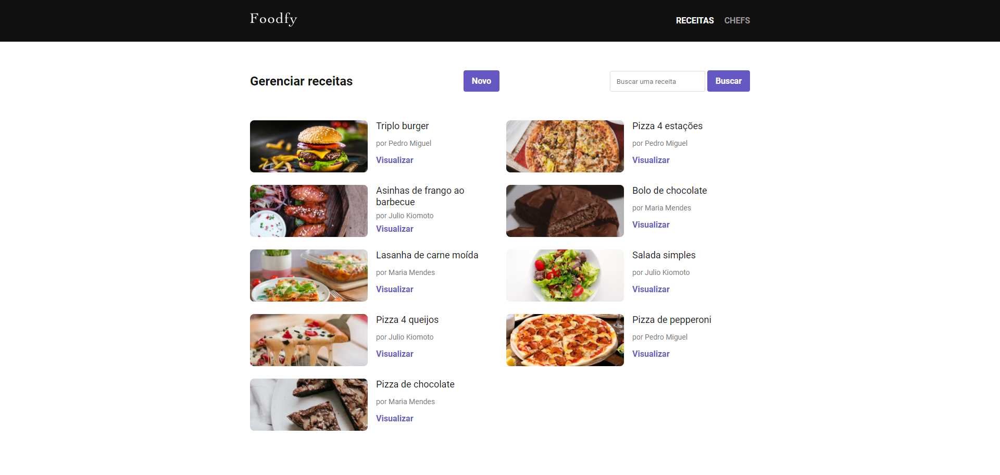
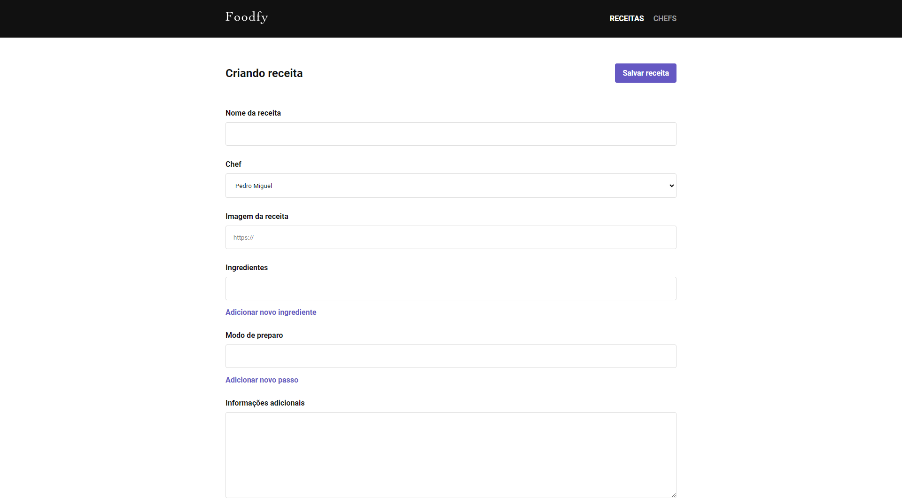

# Foodfy


## 📝 Sobre

**Foodfy** é uma site de receitas, que permite que usuários possam ver as receitas cadastradas, seus ingredientes, modo de preparo e os chefs responsáveis por cada receita 

Além de uma área administrativa, que permite cadastrar/editar/deletar chefs e receitas.

Outras implementações:
-Paginação
-Filtragem por nome

---------

## 🖥️ Demonstração

<h1>
     
  
<h1>
     

<h1>
     

----------


## 🚀 Tecnologias e ferramentas utilizadas

- **HTML5**
- **CSS3**
- **JavaScript**
- **NodeJS**
- **Express**
- **Nunjucks**
- **Method override**
- **PostgreeSQL/Postbird**

---------

## 💻 Instalação e uso

```bash
# Abra um terminal e copie este repositório com o comando
$ git clone https://github.com/RodrigoFonsecaG/foodfy.git
# ou use a opção de download.

# Entre na pasta do projeto 
$ cd foodfy

# Instale as dependências
$ npm install

# Rode o aplicação
$ npm start

#Por fim acesse o localhost:3000 no seu navegador.
```

-----------


