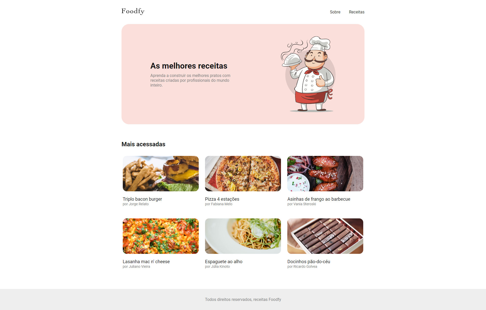

# BeautySalon


## 📝 Sobre

**Foodfy** é uma site de receitas, que permite que usuários possam ver as receitas cadastradas, seus ingredientes, modo de preparo, além de uma área administrativa, onde se tem acesso por dois tipos de perfis: usuário comum e administrador, sendo que cada um tem suas funcionalidades.
  
O site **Foodfy** é um projeto do LaunchBase, que é feita durante o curso com os conhecimentos aprendidos.

---------

## 🖥️ Demonstração

<h1>
     


----------


## 🚀 Tecnologias e ferramentas utilizadas

- **HTML5**
- **CSS3**
- **JavaScript**
- **NodeJS**
- **Express**
- **Nunjucks**

---------

## 💻 Instalação e uso

```bash
# Abra um terminal e copie este repositório com o comando
$ git clone https://github.com/RodrigoFonsecaG/foodfy.git
# ou use a opção de download.

# Entre na pasta do projeto 
$ cd foodfy

# Instale as dependências
$ npm install

# Rode o aplicação
$ npm start

#Por fim acesse o localhost:3000 no seu navegador.
```

-----------


